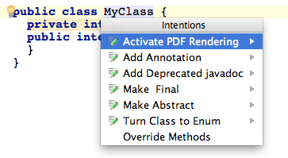
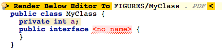
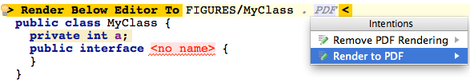

Editor2PDF
==========

Overview
--------
This software makes it possible to attach an annotation to an arbitrary MPS editor cell and render the cell to a PDF file output. The software uses iText to output PDF. You will need MPS 3.1 to compile.

Usage
-----
This language provides an annotation that makes it possible to mark an editor cell for rendering to PDF format. Adding the annotation is possible on any MPS concept (BaseConcept and descendants). To render to PDF, you need to provide an output directory and a file basename. After you have completed this step, you can use the intention "Render to PDF" available on the annotation as many times as you need to regenerate the PDF output. The PDF output will display the content of the editor as it appears in MPS.

Remember that you must add a dependency on the org.campagnelab.mps.editor2pdf
language before you can use the annotation. This must be done in every model where you
need to use the annotation. The intentions will only display if this step has been performed correctly.
See the book at the bottom if you are not sure how to do this.

Credits
-------
PDF files are generated with IText. See http://itext.com/. Editor2PDF was developed by Fabien Campagne to help make figures for the second volume of the MPS Language Workbench book series (see below).

License
-------
Editor2PDF is distributed under the terms of the AFFERO GENERAL PUBLIC LICENSE, in agreement with the open-source license of iText.

Installation
------------

The recommended installation method is from the Jetbrains plugin repository, directly within MPS. Open Preferences/Settings, select plugins, choose the Browse Repositories button and look for Editor2PDF. Continue to install the plugin. Installing the plugin this way will help you get notifications when the plugin is updated.

Tutorial
--------

See the following figures to learn how to use the Editor2PDF:

And the result can be seen [here](figures/MyClass.pdf). Note that this is a fully vectorial PDF that will render wihout loss of resolution in press.

New to MPS? 
-----------
MPS is a powerful platform, but it can be difficult to learn on your own. This book can help:

The MPS Language Workbench: Volume I. 2014. Fabien Campagne (http://books.campagnelab.org).
 

What's new?
-----------
See the project [Change Log](https://github.com/CampagneLaboratory/Editor2PDF/wiki/Change-Log).
